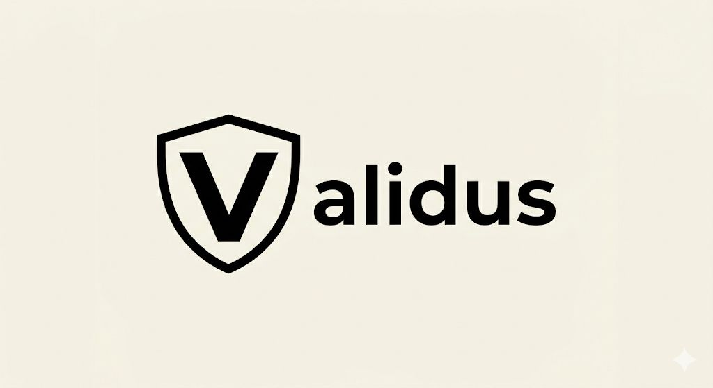

# Validus — AI-Powered Security Audit Platform

## The Problem: Open Source Supply Chain Attacks

In 2025, the `colors.js` and `faker.js` npm packages were intentionally sabotaged by their own maintainer, injecting infinite loops and corrupting data for millions of downstream applications. This wasn't an isolated incident — the `event-stream` attack in 2018 injected cryptocurrency-stealing malware into a package with 2 million weekly downloads, and the `ua-parser-js` hijack in 2021 distributed cryptominers to 8 million users.

**The core problem:** developers blindly trust open-source dependencies. A single malicious update can cascade through the entire software supply chain, and there is no decentralized, transparent, incentive-aligned system to catch these attacks before they ship.

### Real-World Attack Scenarios

1. **Crypto Address Hijacking** — You think your app is sending crypto to your wallet. But the package quietly changes the address. So the money goes to the attacker instead. Your users lose funds and you have no idea until it's too late.

2. **Secret Exfiltration via Update** — You update a normal developer tool. But the update is fake. Once installed, it starts snooping around your computer and steals secrets like tokens, keys, or environment variables. One compromised dependency = full access to your infrastructure.

3. **Poisoned Trust Chain** — Imagine your friend gives you a box of screws. You trust the box because your friend always gives good stuff. But this time, someone secretly swapped one screw with a tiny bomb. You use the whole box, and now the bad part gets into your project. Even trusted packages can become dangerous if one update is poisoned.

### Why This Matters Beyond Tech — BGA Impact

**NGOs:** A small NGO uses an open-source donor management app. One of its npm dependencies is updated with malicious code that silently steals environment variables during install. The leaked secrets include the NGO's database credentials and email API keys, exposing donor data and forcing the NGO to shut down its donation portal for days. A dependency-audit tool like Validus could flag the suspicious install script, outbound network calls, and secret-access behavior before deployment — protecting the donors and the organization's mission.

**Schools:** A school IT team installs a package update for its learning portal. The package contains hidden malware that exfiltrates student records and admin tokens. Student names, grades, and parent contact information are leaked. Validus would scan the package before installation and warn the team before the malicious update reaches production — keeping student data safe.

**Low-Budget Startups:** A bootstrapped startup with no dedicated security team ships a product built on 200+ npm packages. They can't afford a manual security audit for each dependency. One malicious package update slips in, and their entire user database is compromised before they even launch. Validus provides automated, affordable, AI-powered auditing that any team can access — no security budget required, just top up tDCAI and scan.

**The common thread:** organizations that can least afford a breach are the most vulnerable. Validus makes enterprise-grade supply chain security accessible to everyone through decentralized AI and transparent on-chain accountability.

---

## The Solution: Validus

Validus is a decentralized AI-powered security audit platform that scans npm packages for malicious code, vulnerabilities, and supply chain risks. Every audit result is stored on-chain for full transparency, and AI node providers are economically incentivized through staking to deliver accurate, honest audits.

### How It Works

1. **Connect Wallet** — Connect your OKX wallet to DCAI L3 network
2. **Top Up Credits** — Deposit tDCAI to get access to audit services (credits recorded on-chain)
3. **Submit Package** — Enter an npm package name (e.g., `color`) to audit
4. **AI Agent Pipeline** — 4-phase automated analysis:
   - **Phase 1: Dependency Scan** — Map all dependencies, check for known vulnerabilities
   - **Phase 2: Swarm AI Analysis + Risk Scoring** — Multiple AI agents independently analyze code and produce consensus risk scores
   - **Phase 3: Exploit Test Generation** — Generate and run exploit tests to verify vulnerabilities
   - **Phase 4: Sandbox Verification** — Execute package in an isolated sandbox to confirm behavior
5. **On-Chain Report** — Results are stored on DCAI chain with full audit trail

---

## AI Agent Pipeline — How It Works Under the Hood

Validus uses a multi-phase AI agent pipeline where each phase builds on the previous one. No single AI makes the final call — instead, multiple agents work independently and reach consensus, making it extremely difficult for malicious code to slip through.

### Phase 1: Dependency Scan

The first agent crawls the package's entire dependency tree — every direct and transitive dependency is mapped. It checks each one against known vulnerability databases (CVE, OSV, GitHub Advisories) and flags:

- Known malicious packages (typosquats, hijacked packages)
- Dependencies with install scripts (`preinstall`, `postinstall`) that execute arbitrary code
- Unusual network calls during installation
- Packages that access `process.env`, `fs`, or `child_process` without clear justification

**Output:** A full dependency graph with risk annotations for each node.

### Phase 2: Swarm AI Analysis + Risk Scoring

Multiple independent AI agents analyze the source code in parallel. Each agent specializes in a different attack vector:

- **Agent A (Behavioral Analysis)** — Looks for code that behaves differently from what the package description claims. e.g., a "color formatting" library that reads environment variables.
- **Agent B (Pattern Matching)** — Detects known malicious patterns: obfuscated code, base64-encoded payloads, dynamic `eval()` calls, encoded URLs pointing to external servers.
- **Agent C (Diff Analysis)** — Compares the current version against previous versions. Flags any new code that introduces file system access, network calls, or crypto operations that didn't exist before.

Each agent produces an independent risk score (0.0 – 10.0). The scores are aggregated using a weighted consensus algorithm:

| Score Range | Rating | Meaning |
|-------------|--------|---------|
| 0.0 – 1.9 | Safe | No suspicious behavior detected |
| 2.0 – 4.9 | Low | Minor concerns, likely false positives |
| 5.0 – 6.9 | Warning | Suspicious patterns found, manual review recommended |
| 7.0 – 8.9 | High | Likely malicious behavior detected |
| 9.0 – 10.0 | Critical | Confirmed malicious patterns, do not install |

**Output:** Per-file risk scores, flagged code lines, and a consensus risk rating.

### Phase 3: Exploit Test Generation

For any findings rated Warning or above, the pipeline automatically generates exploit test cases:

- If the agent found a suspicious `eval()`, it generates a test that triggers it with a crafted payload
- If network exfiltration is suspected, it generates a test that monitors outbound connections
- If environment variable access is detected, it checks what specific variables are read and where they're sent

These tests are executable — they prove whether a vulnerability is theoretical or actually exploitable.

**Output:** Generated test files with pass/fail results for each suspected vulnerability.

### Phase 4: Sandbox Verification

The final phase runs the package in a fully isolated sandbox environment:

- Network access is monitored and restricted (all outbound calls are logged)
- File system access is tracked (reads/writes outside the package directory are flagged)
- Process spawning is monitored (`child_process.exec`, `spawn` calls)
- Memory and CPU usage are profiled for cryptomining behavior

The sandbox confirms or denies the findings from Phase 2 and Phase 3 with actual runtime evidence.

**Output:** Runtime behavior log, confirmed/denied findings, final risk score.

### Final Report

All four phases are combined into a single audit report that is:

1. **Stored on DCAI L3** via the `ValidusReport` smart contract — immutable and publicly queryable
2. **Linked to the auditor's stake** — if the report is later proven wrong, the auditor's tDCAI stake is slashed
3. **Queryable by anyone** — call `getReport(id)` or browse via the explorer

```
Report #1 — ValidusStaking.sol
Overall Score: 72/100 (Warning)
Findings: 1 Critical, 2 High, 3 Medium, 4 Low, 2 Info
Status: FAILED
Explorer: http://139.180.140.143:3002/tx/0x6b0c1a...
```

---

### Resolution & Dispute System

When a potential threat is detected:

1. **Outcome Proposed** — Swarm AI flags malicious code (outcome: Yes)
2. **Dispute Window** — Anyone can challenge by putting up a bond
3. **First Round Voting** — AI agents vote on the outcome
4. **Discussion** — Multiple AI agents debate the findings
5. **Second Round Voting** — Final consensus vote
6. **Final Outcome** — If the original finding stands, the disputer's bond is slashed

This mechanism ensures node providers keep their AI models updated and honest, and users get the best audit service possible.

---

## How We Utilize Dash Platform

Dash Platform provides the identity and data layer for Validus:

| Feature | How It Works |
|---------|-------------|
| **Identity Management** | Each auditor and user has a Dash Platform identity tied to their on-chain actions |
| **DPNS Naming** | Human-readable aliases (e.g., `validus.dash`) for identity resolution |
| **Data Contracts** | Structured audit metadata stored on Dash Platform for cross-chain discoverability |
| **Ceiling Estimates** | Scan pricing quotes are generated based on billable lines and estimated time, denominated in tDASH |

---

## How We Utilize DCAI L3

DCAI L3 is the EVM-compatible execution layer where all financial and audit logic runs:

| Feature | How It Works |
|---------|-------------|
| **Top Up** | Users send tDCAI to the ValidusStaking contract — credits are recorded on-chain and used to pay for audit services |
| **Stake** | AI node providers lock tDCAI as collateral to participate in the audit network — honest work earns staking rewards |
| **Slash** | If an AI node provider submits a dishonest audit (e.g., claims malicious code is safe), their entire stake is slashed through the on-chain resolution process |
| **On-Chain Reports** | Every audit report is submitted to the ValidusReport contract — anyone can query and verify results |
| **Builder Pass NFT** | Access control via ERC-721 token ownership on DCAI L3 |

---

## On-Chain Deployments

### Dash Platform

| Resource | Identifier |
|----------|------------|
| **Platform Identity** | `DkFeADqFup7kxWPZAW9ZMrY4MvxCq2u9Tm4dz8vM8cWv` |
| **Data Contract** | `7HWCuY12REWbP68wQDcmtCPuZA8Cncjv9ZafyXdqXgf6` |

### Smart Contracts (DCAI L3 — Chain ID 18441)

| Contract | Address | Purpose |
|----------|---------|---------|
| **ValidusStaking** | `0x2Fbc8aD3137991e77BC45f40c3B80e2c31B88842` | Top-up credits, staking, and slashing |
| **ValidusReport** | `0x7fD01C2d75E271e34eF7ABec9BB9Da2C4E78f8Da` | On-chain audit report storage & querying |

### Key Transactions

| Description | Tx Hash |
|------------|---------|
| ValidusStaking deployment | Contract created at `0x2Fbc8aD3137991e77BC45f40c3B80e2c31B88842` |
| ValidusReport deployment | Contract created at `0x7fD01C2d75E271e34eF7ABec9BB9Da2C4E78f8Da` |
| Code quality report submitted | `0x6b0c1a1a972ef09144be37dceca056e4ec3b262c6cd700577e02bcaa5ba47668` |
| Top-up test (0.001 tDCAI) | Confirmed via Hardhat — credits: 0.005 tDCAI |

---

## Setup

```bash
cd frontend
cp .env.example .env
# Fill in DASH_IDENTITY_ID, EVOGUARD_PRIVATE_KEY_WIF
npm install
npm run dev
```

### Hardhat (Smart Contracts)

```bash
cd backend
npm install
npx hardhat compile
npx hardhat run scripts/deploy.js --network dcai
```

## Pages

| Route | Description |
|-------|-------------|
| `/` | Main dashboard — package search, audit quotes, scan initiation |
| `/report2` | Detailed audit report with on-chain findings, risk scores, explorer links |
| `/dcai/stack` | DCAI staking dashboard — top up, stake, slash, submit reports |
| `/profile` | User profile — wallet info, staking, resolution system demo |
| `/evoguard` | Dash Platform identity validation and contract deployment |

## API Routes

| Route | Method | Description |
|-------|--------|-------------|
| `/api/dcai/rpc` | POST | Proxy for DCAI RPC (bypasses CORS) |
| `/api/dcai/send-tx` | POST | Server-side transaction signing and broadcasting |
| `/api/dcai/query-reports` | GET | Query on-chain audit reports by ID or auditor |
| `/api/evoguard/status` | GET | Dash Platform identity status |
| `/api/evoguard/contract/deploy` | POST | Deploy data contract on Dash Platform |
